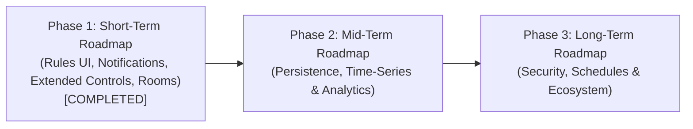

# Home Automation Hub - Project Status & Roadmap 🏠⚡

**Last Updated:** October 2026  
**Repository:** `HomeAutomationHub`  
**Architecture:** Monorepo (.NET 10 Minimal APIs + MQTT + SignalR + React 19 / Vite + Tailwind CSS v4)

---

## 1. Project Overview

**Home Automation Hub** is an IoT management dashboard designed for sub-second telemetry ingestion and bi-directional device control. The system leverages an event-driven architecture where IoT hardware messages (published via an Eclipse Mosquitto MQTT broker) are ingested by an ASP.NET Core background listener and broadcast in real time to web clients over SignalR websockets.

---

## 2. What Has Been Done So Far

### 2.1 Core Infrastructure & Backend Gateway (.NET 10)
* **MQTT Broker Containerization:** Mosquitto MQTT broker configured with Docker Compose, handling TCP connections (port 1883) and WebSocket bridges (port 9001).
* **Resilient Background Ingestion:** `MqttListenerService` operates as an ASP.NET Core `BackgroundService`, auto-subscribing to `home/devices/+/telemetry` with automatic polling and reconnection backoff.
* **Thread-Safe In-Memory Store:** `InMemoryDeviceStateStore` utilizes `ConcurrentDictionary<string, DeviceState>` to maintain device states with zero disk I/O latency.
* **Real-Time SignalR Hub:** Strongly typed `HomeHub : Hub<IHomeClient>` streams `DeviceStateChanged`, `RuleTriggered`, and `NotificationReceived` events to web clients.
* **Actuator Command Dispatcher:** REST `POST /api/devices/{deviceId}/command` endpoint publishes commands to `home/devices/{deviceId}/set` with QoS 1 (`AtLeastOnce`).

---

### 2.2 Short-Term Roadmap Implementations (Completed Milestone)

#### 1. Configurable Automation Rules Manager UI & Rule Engine
* **Evaluation Engine:** `RuleEngineService` monitors incoming sensor telemetry against comparison operators (`GreaterThan`, `LessThan`, `Equals`).
* **Hysteresis Cooldown:** Built-in 10-second debounce mechanism prevents flapping or execution loops when telemetry hovers near thresholds.
* **Automated Actuator Dispatching:** Automatically triggers target devices over MQTT and broadcasts real-time execution alerts via SignalR.
* **Full Management UI:** Dedicated *Otomasyon Kuralları* tab with rule listing, real-time enable/disable switches, delete actions, visual flow diagrams, and a creation modal with a live summary sentence preview.

#### 2. Live Notification Toast & History System
* **Multi-Toast Queue:** Floating toast stack in the bottom-right corner supporting multiple concurrent toasts with independent 5-second auto-dismiss timers and manual close controls.
* **Themed Alerts:** Color-coded accents and icons for **Otomasyon** (Amber / `Zap`), **Sistem** (Sky blue / `Info`), and status alerts.
* **Slide-Over History Drawer:** Right-side drawer accessible via the top-bar Bell icon, featuring live unread counters, category filters (*Tümü*, *Otomasyonlar*, *Sistem*), and bulk actions (*Tümünü Okundu İşaretle*, *Tümünü Temizle*).
* **Session Persistence:** History is preserved across browser refreshes via `sessionStorage`.

#### 3. Extended Device Controls (Dimmers & Climate Controls)
* **Smart Light Dimming:** Smooth brightness slider ($1\% - 100\%$) with one-tap quick preset chips ($25\%$, $50\%$, $75\%$, $100\%$) and automatic turn-on on brightness increase.
* **Color Temperature Presets:** Quick selection for **Sıcak (2700K)**, **Doğal (4000K)**, and **Soğuk (6500K)** with matching visual tone pills.
* **Thermostat & Climate Controls:** Dual display for ambient and setpoint temperatures, fine-tuning stepper buttons ($[-]/[+]$ $0.5^{\circ}\text{C}$ steps), setpoint slider ($16^{\circ}\text{C} - 30^{\circ}\text{C}$), and working mode selectors (**Isıtma**, **Soğutma**, **Eco**).
* **Collapsible Drawer:** Controls are neatly housed inside an expandable accordion drawer on each card to keep the dashboard uncluttered.

#### 4. Room & Zone Grouping with Batch Controls
* **Intelligent Room Resolution:** Multi-tiered room classifier prioritizing user assignments (`localStorage`) $\rightarrow$ MQTT `telemetry.room` metadata $\rightarrow$ semantic device ID heuristics (*living-room-light* $\rightarrow$ **Salon**, *bedroom-sensor* $\rightarrow$ **Yatak Odası**, etc.).
* **Room-Level Master Switches:** One-tap batch controls (**"Tümünü Aç"** / **"Tümünü Kapat"**) to control all devices in a room simultaneously.
* **Room Filter Pills & Dual Views:** Filter pills at the top of the dashboard and a view switcher between **Oda Gruplu** (grouped sections with room metrics) and **Düz Izgara** (flat grid).
* **Interactive Room Reassignment:** Room badge on each card with an inline dropdown selector allowing instant room reassignment.

---

## 3. Future Roadmap: What Will Be Done Next

The remaining roadmap is structured into two upcoming development phases:

---

### 3.1 Mid-Term Roadmap: Persistence & Analytics

#### 1. Persistent Storage (SQLite & Entity Framework Core)
* **Goal:** Prevent state loss on backend restarts.
* **Description:** Integrate SQLite and EF Core to persist device registrations, user-defined room assignments, and automation rules in a local database file, while maintaining fast in-memory caches for real-time reads.

#### 2. Historical Time-Series Telemetry & Interactive Charts
* **Goal:** Track and visualize telemetry trends over time.
* **Description:** Periodically log temperature, humidity, and power readings to a time-series table. Integrate interactive charts (Recharts or Chart.js) into device cards or a dedicated analytics modal showing 1-hour, 24-hour, and 7-day trendlines with min/max markers.

#### 3. Device Health & Heartbeat Timeout Detection
* **Goal:** Detect unreachable or dead IoT hardware nodes.
* **Description:** Background scanner evaluating device last-seen timestamps: if no telemetry is received within a configurable window (e.g., 5 minutes), mark the device as **Çevrimdışı (Offline)** and visually dim its card. Additionally, subscribe to MQTT Last Will and Testament (LWT) topics (`home/devices/{id}/status`).

#### 4. Centralized Configuration Management
* **Goal:** Eliminate hardcoded endpoints and connection strings.
* **Description:** Migrate MQTT broker host/port and frontend URLs to `appsettings.json` and environment variables using the .NET `IOptions<MqttOptions>` pattern, and bind the frontend to `import.meta.env.VITE_API_BASE_URL`.

---

### 3.2 Long-Term Roadmap: Security, Advanced Automations & Ecosystem

#### 1. Authentication & Role-Based Access Control (RBAC)
* **Goal:** Secure hub endpoints and restrict actions.
* **Description:** Implement JWT Bearer authentication and role-based permissions separating **Admin** users (who can create/delete rules and assign rooms) from **Guest/Operator** users (who can only toggle devices).

#### 2. Time-Based Scheduling & Multi-Condition Logic
* **Goal:** Sophisticated smart home routines.
* **Description:** Extend the rule engine with cron-like time triggers (e.g., *"Turn on porch light at sunset / 20:00"*) and compound logical conditions (e.g., *If Motion == true AND AmbientLight < 20 lux*).

#### 3. Home Assistant & Zigbee2MQTT Interoperability
* **Goal:** Connect off-the-shelf consumer hardware.
* **Description:** Support the Home Assistant MQTT Discovery standard (`homeassistant/sensor/{id}/config`) to automatically discover Zigbee2MQTT and ESPHome devices on the local broker.

#### 4. Progressive Web App (PWA) & Mobile Push Notifications
* **Goal:** Mobile installation and urgent sensor alerts.
* **Description:** Configure service workers and app manifest for mobile home screen installation, with Web Push alerts for critical safety events (e.g. water leak or high-temperature alarms).
